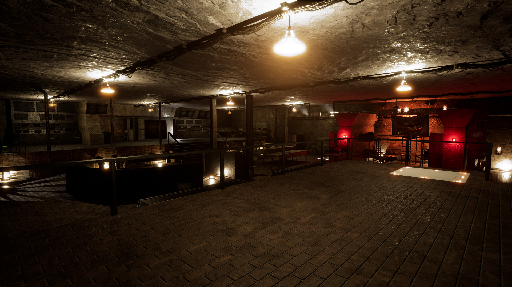
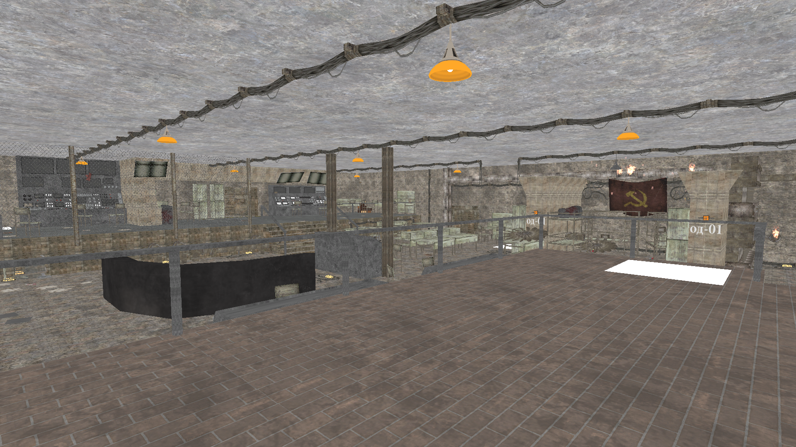
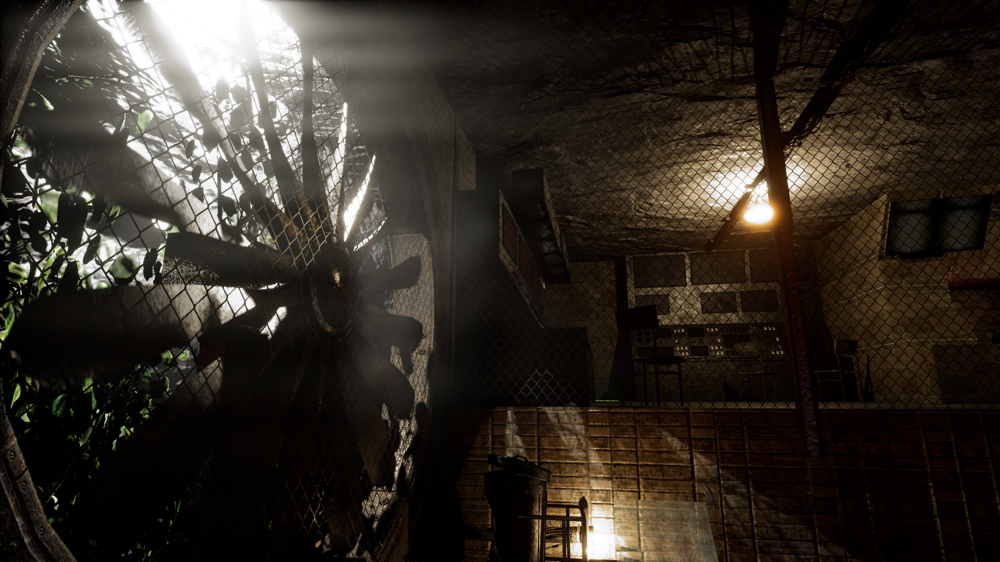
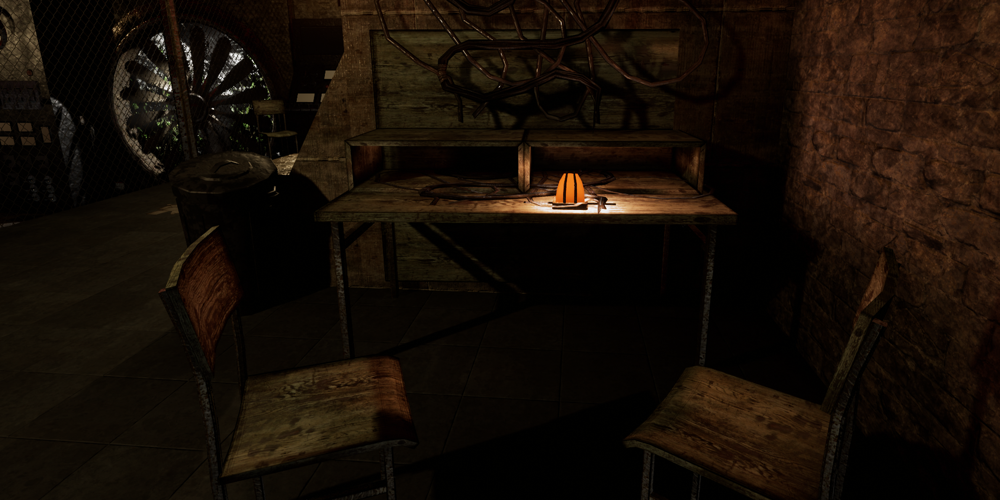
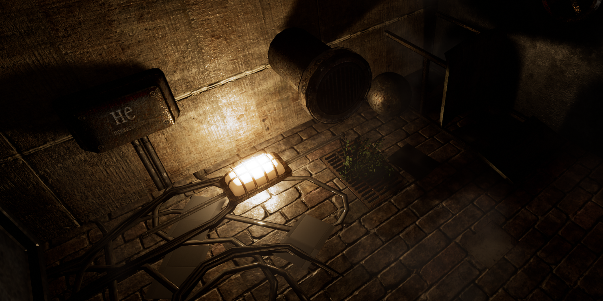
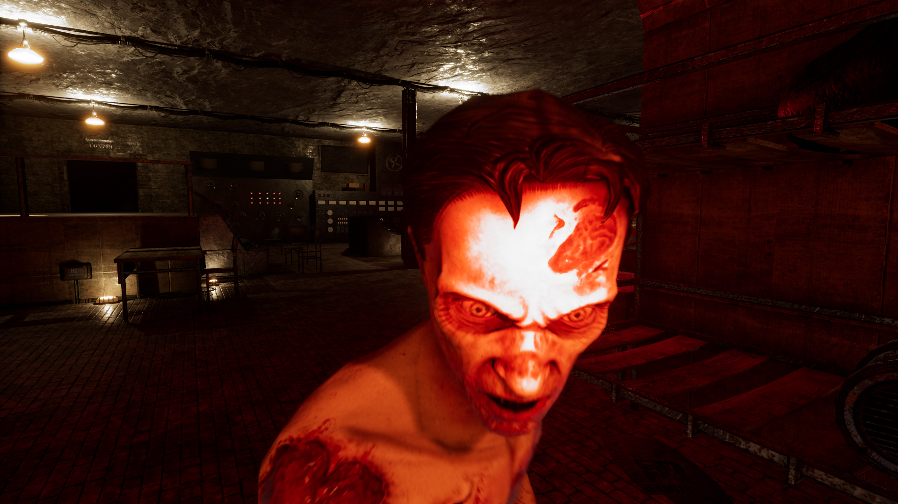
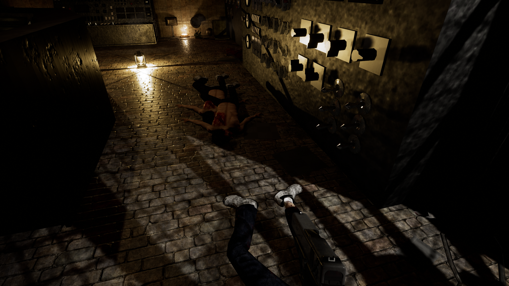
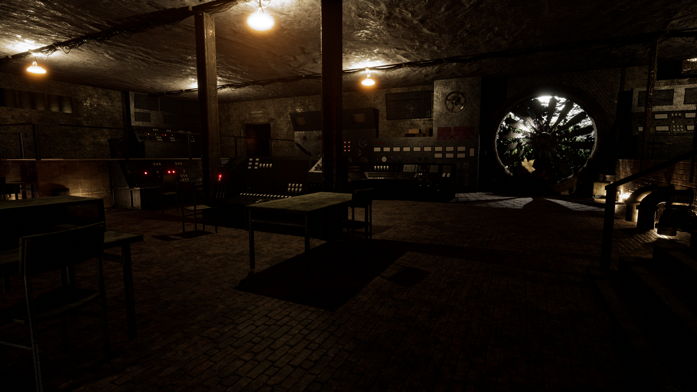

# LightsOut

3D Survival Shooter created as part of the [Open Games Workshop](http://www.medien.ifi.lmu.de/lehre/ss17/ogw/) at LMU Munich in a four-person team.

- Unreal Engine 4.15
- Autodesk Maya 2015
- [Trailer](https://youtu.be/qXQl8TKWgio)

 
===
 
  
 

